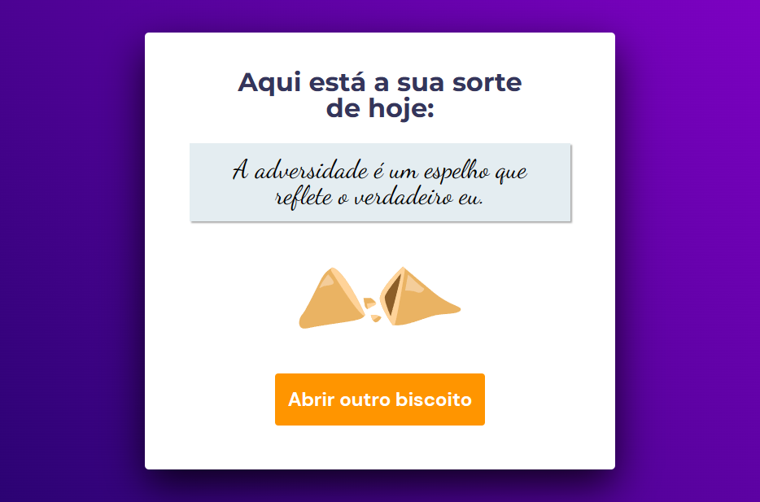

<h1>Projeto Biscoito da Sorte</h1>

  
   
  

 

> Trilha Explorer 06

 

## 🚀 Tecnologias

Esse projeto foi desenvolvido com as seguintes tecnologias:

- HTML
- CSS
- Javascript
- Git
- Github
- Figma

## 💻 Projeto

Projeto prático de uma Biscoito da Sorte da Trilha Explorer da Rocketseat.

- [Acesse o projeto finalizado, online](https://hugolinobg.github.io/biscoito/)

## 🔖 Layout

Você pode visualizar o layout do projeto através [DESSE LINK](<https://www.figma.com/file/krJatIDt6uKV83Kke4Orcc/Biscoito-da-Sorte-(Community)?type=design&mode=design>). É necessário ter conta no [Figma](https://figma.com) para acessá-lo.

## ✉️ [Contato](https://hugolino.dev)

hugolino2609@gmail.com
